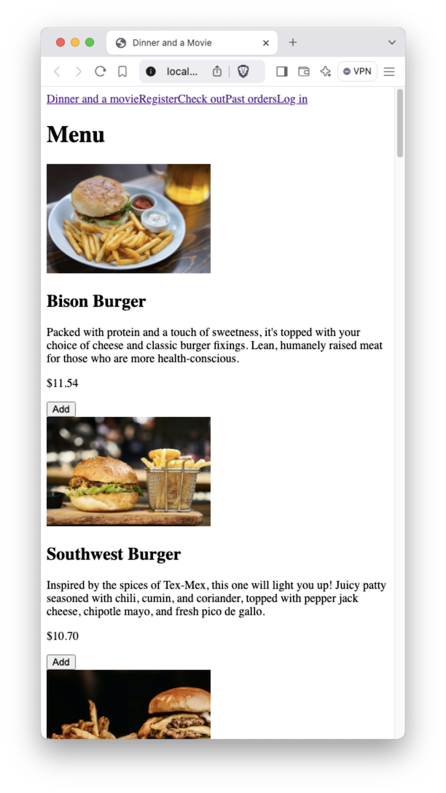
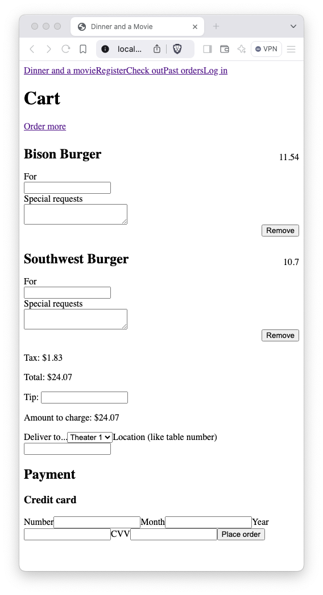

# HTML Lab

In this lab we're going to create some pages. We'll give you a few descriptions and screenshots and you'll bring them to life.

## Home/Landing page
This is the page that the user sees immediately upon visiting. It's always smart to get the user to their goal ASAP. And since they're here to order food, we'll put the menu right up front with buttons for them to add menuItems to their cart.
1. Create index.html.
1. Give it these features:
- A nav menu of links at the top.
- A series of menu items, each with an image, a `<h2>` with the item name, `
` tags with the item's description, its price, and a button that says "Add"
- Don't worry about sizing the image yet.
- Note that there are no spaces between the nav menu links. That's also fine for now.
- Here's a screenshot

## Cart page
This page shows the user the contents of their cart and allows them to enter credit card payment information for them to checkout and purchase.
1. Make it look approximately like the screenshot below.

