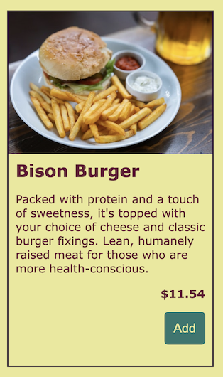
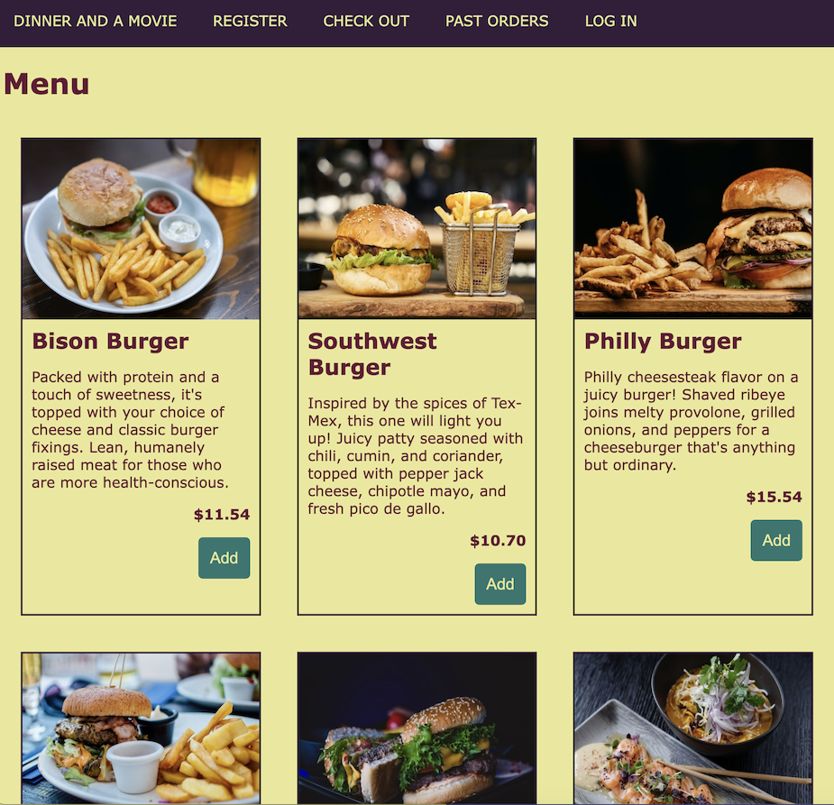

# CSS Layout Lab

## Applying global styles
1. By this time you should have a site-wide css file. If you don't, create one. Put this in it:
```css
:root {
  --dark1: #641634;
  --dark2: #341D3A;
  --dark3: #29776F;
  --light1: #EBE896;
  --light2: #CCB280;

  color: var(--dark1);
  background-color: var(--light1);

  font-family: Verdana, Geneva, Tahoma, sans-serif;
}
```
This should match your colors and fonts to the screenshots below.

## Laying out the navbar
1. The navbar has been all bunched up since we added it. It's time to spread it out. Make it look like this:

- Hint: flexbox is your friend here. You can use it to space out the links in the navbar.

## Laying out the menu items
1. Notice on the landing page that you have multiple menu items. Each menu item should be laid out like so:

- Image on top, then the name, then the description, then the price, then the button.
1. Copy and paste your menuItems so that you have about 20 of them. lay out the page such that the page has menuItems side by side, wrapping down to the next line as many times as are needed.


