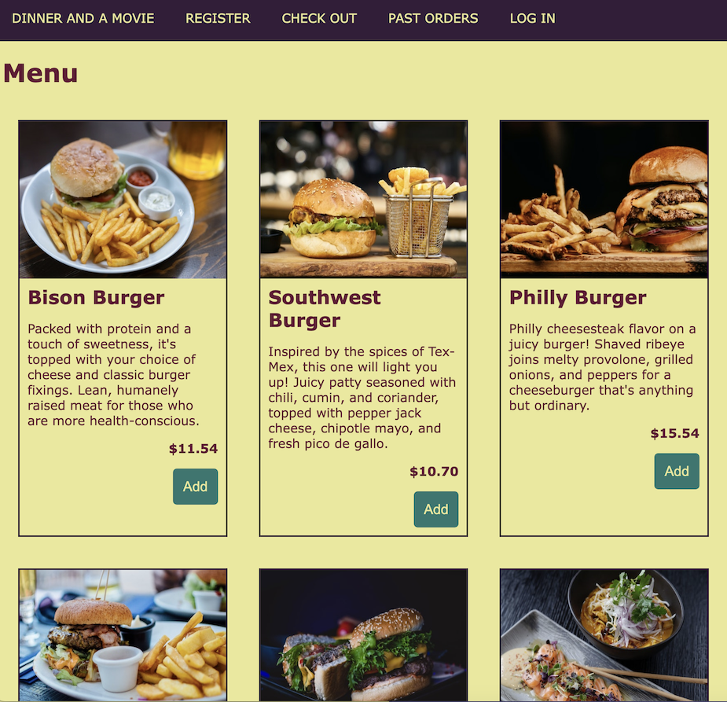

# Styling Lab

You learned the two official ways to style React components; CSS-in-JS local to the component and global CSS from an external stylesheet. In this lab, you'll begin to apply them to your components in order to make them look like the screenshot from previous labs which we'll display again for you below.

## The landing scene

## The checkout scene

## Bonus!
Bonus points for those who create an even better looking site than the screenshots. Feel free to play with the color palette, fonts, and style of the elements to make it your own.