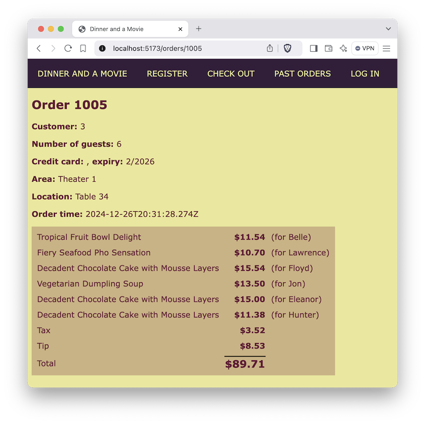

# useState and useEffect Lab

So far we're hardcoding the menuItems in the Menu component. In this lab we're going to fetch the menuItems for real from the API server and display them on the page. But before we do, let's warm up with a simpler task; creating a shopping cart.

## Creating the cart
Users will need a cart.
1. Edit App.tsx. Import useState at the top. Call it like so:
```typescript
const [cart, setCart] = useState<CartItem[]>([]);
```
This will be the cart used throughout the app.
1. Find your addToCart function that currently console.log()s the MenuItem. Make it convert the MenuItem into a CartItem and add to the cart.
1. Create another called removeFromCart that receives one CartItem and removes it from the cart.
1. Create a third called changeCartItem that receives one CartItem, finds the item in the cart with the same id, and replaces it with the passed-in CartItem.

Note: all of those will need to call setCart for the changes to be saved and re-rendered.

## Reading the menuItems
1. Edit Menu.tsx. Import useEffect at the top.
1.  Call useState to create an array called "menuItems" and a setter function called "setMenuItems". This new variable will take the place of the hardcoded menuItems.
1. In the useEffect, fetch menuItems from "/api/menuItems" and, once it is resolved, call setMenuItems with them.
1. Run and test. You should see the first X menuItems in your browser; however many you decided to display before.

## Reading all the orders

In this section we're going to read all the orders from the API server but don't get too excited, we're not going to display them yet.
1. Edit Orders.tsx. Import useEffect and useState at the top.
1. Call useState to create an array called "orders" and a setter function called "setOrders".
1. In the useEffect, fetch orders from "/api/orders" and, once it is resolved, call setOrders with them.
1. After the useEffect `console.log(orders)`. 

If you see that your orders are an empty array for a split second and then are replaced with a list of orders, you've done it right. Later on we'll display all those orders.

# Reading single orders

1. Edit Order.tsx. Just inside the function declaration create a variable called orderId:
```typescript
const orderId = 1005;  // Or any valid order ID
```
1. Create a state variable using useState called "order".
1. Create a useEffect that runs on component creation to fetch that order from the API server. Once the server responds, call your "setOrder" function.
1. Populate the top details like in the screenshot below. Don't worry about displaying the order items yet. We'll do that in the next lab.


As before, you should see an empty order for a split second before it is replaced with the order details. 