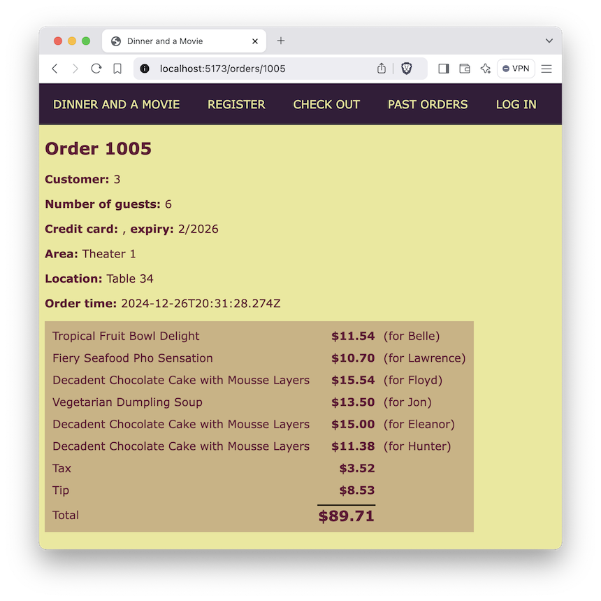

# JSX Logic Lab

In this lab we'll be adding some logic to our JSX. We'll be using the ternary operator to conditionally display elements and the .map() function to iterate over arrays.

## Conditional Display

1. Edit App.tsx. Find the section that displays the navbar. If the user is logged in, greet them by name. If they are not logged in, display a link to "/login".
1. In Cart.tsx, find the section that displays the cart. If the cart is empty, display a `
` message saying so. If the cart has items, display them by .map()ing over them.

## Iterating menuItems
As of now, you've manually copy/pasted some fixed number of menu items. But we've fetched a different number. Let's display them all by iterating over the menuItems array.

1. Edit Menu.tsx. Find the section that displays the menu items. Replace the hardcoded menu items with a .map() function that iterates over the menuItems array, displaying each.
1. Run and test. You should see all the menu items displayed.

## Iterating orders
1. Edit Orders.tsx. Note that you're reading and console.logging() the orders. Now iterate over the orders array and display each in a `<tr>`.

## Iterating order items
1. Edit Order.tsx. Find the order items section that you skipped over in the last lab. Iterate over those order items and display each like in the screenshot repeated below.
1. Run and test. You should see all the order items displayed.

In the next lab we'll also iterate the cart items passed in to the Cart component.